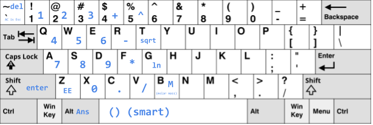

# Qalc

A simple and powerful calculator that runs purely in the browser and allows custom key mappings.

## Getting started
- Go to https://storchdev.github.io/qalc
- Click settings, then the one-hand preset
- Optional: export the settings now and change the keybinds to your liking
- Use the reference below to learn the one-hand preset

## Default one-hand keybinds reference

## Todo
- [x] save history to local storage
- [x] fix rounding
- [x] update state information when moving thru expressions
- [x] import local storage
- [x] fix exponent bug
- [x] add unary -

- [ ] pi, trig functions, other?
- [ ] config editor
- [ ] expression templates

